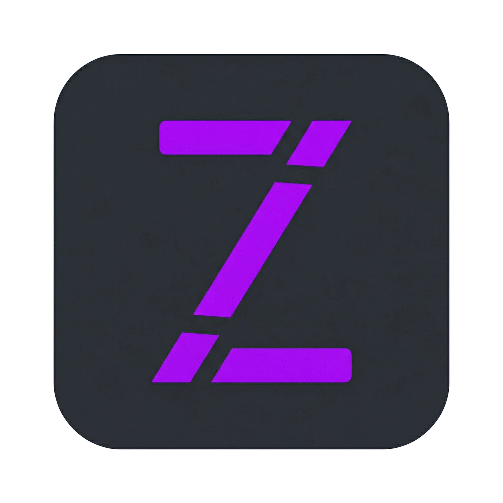

# Zoaholic

<p align="center">
  
</p>

Zoaholic is a next-generation LLM API gateway built on top of the excellent open‑source project uni-api.

While the original uni-api forces all traffic into the OpenAI format, Zoaholic introduces a **Multi-Dialect Architecture**. It natively understands and translates between the OpenAI (`/v1/chat/completions`), Anthropic Claude (`/v1/messages`), and Google Gemini (`/v1beta/...`) protocols.

Combined with a new dynamic Python plugin system and a modern React frontend, Zoaholic is designed for self‑hosted, power‑user scenarios where flexibility and protocol compatibility are paramount.

## Features

### 🗣️ Multi-Dialect Gateway
Send requests in your preferred format, and Zoaholic will automatically translate the prompt format, tool calls, and streaming responses (SSE) to match the upstream provider. 
- Example: Send a Claude API request to an OpenAI GPT-4o backend, and receive a Claude-formatted response.

### 🔌 Dynamic Plugin System
Extend Zoaholic's capabilities without touching the core codebase via Python interceptors.
- **Claude Thinking Plugin**: Automatically injects `<thinking>` pre-fills for models ending in `-thinking`, adjusts max tokens, and elegantly splits the streaming response into `reasoning_content` and standard `content`.
- Add new channels, dialects, and safety filters on the fly.

### 🖥️ Modern React Console
A built-in Material Design UI powered by Vite, React, Tailwind CSS, and Radix UI. Manage channels, test models, and monitor API traffic locally at `http://localhost:8000/`.

### ⚖️ Enterprise-grade Load Balancing
Inherits the robust routing core from uni-api:
- Algorithms: Fixed priority, Round-robin, Weighted, Lottery, and Smart routing.
- High Availability: Automatic retries, channel cooldowns, and independent model timeout handling.
- Fine-grained per-API-key rate limiting.

## Quick Start

Zoaholic uses a single `api.yaml` for configuration, remaining 100% compatible with existing uni-api configs.

## Database & Cloud Deploy (Local / Render etc.)

Zoaholic stores stats/logs via an async SQLAlchemy database, and it can also **persist the runtime configuration (previously api.yaml) into the database**, which is more suitable for Render-like environments.

- Default (local): **SQLite**
- Recommended for cloud: **PostgreSQL** (Render usually provides `DATABASE_URL`)

### 1) Use `DATABASE_URL` (recommended)

When `DATABASE_URL` (or `DB_URL` / `SQLALCHEMY_DATABASE_URL`) is provided, Zoaholic will auto-detect and connect:

- `postgres://...` / `postgresql://...` → auto-normalized to `postgresql+asyncpg://...`
- `sqlite:///...` → auto-normalized to `sqlite+aiosqlite:///...`

### 2) Use DB_TYPE / DB_PATH (SQLite)

- `DB_TYPE=sqlite`
- `DB_PATH=./data/stats.db`

### 3) Disable DB (for environments without persistent disk)

- `DISABLE_DATABASE=true`

## Config Persistence (Store config in DB)

By default, `CONFIG_STORAGE=auto`:

- If DB is available: load config from DB (DB becomes the **source of truth**)
- If DB has no config yet: load once from `api.yaml` / `CONFIG_URL` / `CONFIG_YAML(_BASE64)` as a seed, then write into DB

Environment variables:

- `CONFIG_STORAGE=auto|db|file|url`
  - `auto` (default): prefer DB when available
  - `db`: force DB-first (fallback seed then persist into DB)
  - `file`: read local `api.yaml` only
  - `url`: read `CONFIG_URL` only
- `SYNC_CONFIG_TO_FILE=true|false`: sync DB/remote config back to `api.yaml` (cloud recommended: `false`)
- `CONFIG_YAML`: raw YAML text
- `CONFIG_YAML_BASE64`: base64 YAML text (recommended for multiline)

> Once persisted, the primary storage in DB is JSON/JSONB (PostgreSQL uses JSONB).

A minimal example `api.yaml`:

```yaml
providers:
  - provider: openai
    base_url: https://api.openai.com/v1/chat/completions
    api: sk-your-openai-key

api_keys:
  - api: sk-your-zoaholic-client-key
    model:
      - gpt-4o
```

Run with Docker:

```bash
docker run -d \
  --name zoaholic \
  -p 8000:8000 \
  -v ./api.yaml:/home/api.yaml \
  zoaholic:latest
```

Access the UI at `http://localhost:8000/`.

## Architecture Overview

- `core/dialects/`: The core transformation engine handling request/response translation between API protocols.
- `core/channels/`: The registry for upstream provider adapters (AWS, Azure, Vertex, Cloudflare, etc.).
- `core/plugins/` & `plugins/`: The interceptor-based plugin engine.
- `frontend/`: Standalone React application that mounts statically via FastAPI.

## Relationship to uni-api

Zoaholic is a downstream project of uni-api. The core routing logic (`core/routing.py`) and handler architecture come directly from uni-api.

If you need the original upstream project, please visit:
- GitHub: https://github.com/yym68686/uni-api

Zoaholic builds upon this solid foundation to add Multi-dialect routing, a Plugin engine, and a React GUI.

## Development Tools

This project is developed using [Lim Code](https://github.com/Lianues/Lim-Code).